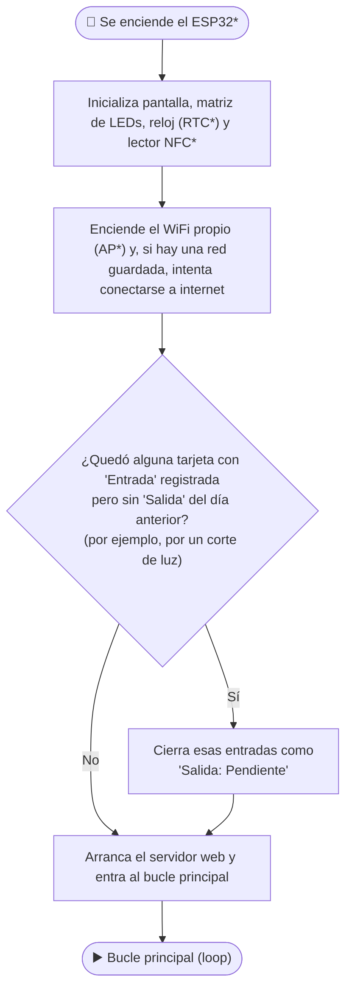
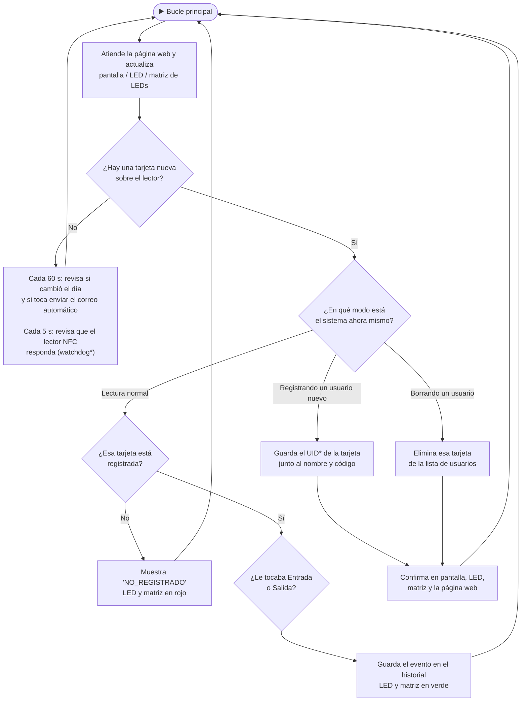
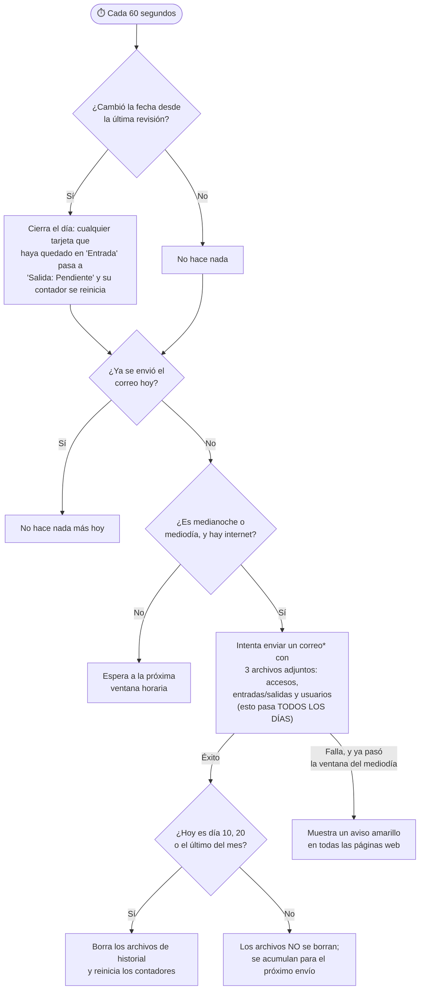

# Documentación técnica del código — Sistema NFC ESP32

Referencia para desarrolladores que lean, entiendan o modifiquen `src/main.cpp`.

---

## Contenido

1. [Arquitectura general](#arquitectura-general)
2. [Organización del código](#organización-del-código)
3. [Sistema de timers no bloqueantes con millis()](#sistema-de-timers-no-bloqueantes-con-millis)
4. [Máquina de estados del LED RGB](#máquina-de-estados-del-led-rgb)
5. [Sistema de matriz LED WS2812B](#sistema-de-matriz-led-ws2812b)
6. [Sistema de cierre de día](#sistema-de-cierre-de-día)
7. [Comunicación UART con el PN532 y watchdog](#comunicación-uart-con-el-pn532-y-watchdog)
8. [Anti-rebote y cooldown de tarjetas](#anti-rebote-y-cooldown-de-tarjetas)
9. [Por qué existe ARCHIVO_UIDS además de NVS](#por-qué-existe-archivo_uids-además-de-nvs)
10. [Lógica par/impar para entradas y salidas](#lógica-parimpar-para-entradas-y-salidas)
11. [Actualización retroactiva de nombre/código en el historial](#actualización-retroactiva-de-nombrecódigo-en-el-historial)
12. [Secuencia de recuperación del UART del PN532](#secuencia-de-recuperación-del-uart-del-pn532)
13. [Consideraciones del DS3231 con RTClib](#consideraciones-del-ds3231-con-rtclib)
14. [Decisiones de diseño no obvias](#decisiones-de-diseño-no-obvias)
15. [Diagrama de flujo del programa (para todos)](#diagrama-de-flujo-del-programa-para-todos)
16. [Glosario técnico](#glosario-técnico)

---

## Arquitectura general

Todo el código reside en un único archivo `src/main.cpp` (~2000 líneas). No hay módulos separados ni cabeceras propias. La única cabecera externa incluida directamente es `nvs.h` del ESP-IDF, necesaria para iterar las claves NVS.

### Capas de almacenamiento

```
┌──────────────────────────────────────────────────────┐
│ NVS (Preferences, namespace "nfc")                   │
│  <uid>      → nombre del usuario                     │
│  k<uid>     → código del usuario                     │
│  c<uid>     → contador entrada/salida (par/impar)    │
│  f<uid>     → fecha último acceso "YYYY-MM-DD"       │
│  buildID    → __DATE__ + __TIME__ (detección firmware)│
│  lastCierre → "YYYY-MM-DD" último cierre de día      │
│  lastEmail  → "YYYY-MM-DD" último email automático   │
│  emailPend  → bool: bandera de reporte pendiente sin enviar│
│  lastReg    → buzón registro: "OK|uid|nombre|codigo|ts"│
│  lastDel    → buzón borrado: "DELETED|..." / "NOT_FOUND|..."│
│  emailDest  → email de destino para reportes         │
│  ssidWifi   → SSID de la red WiFi con internet       │
│  claveWifi  → contraseña WiFi                        │
│  ntpOffset  → offset UTC en segundos (default -18000)│
│  emailCntDate → "YYYY-MM-DD" del contador de correos │
│  emailCnt   → int: correos enviados en emailCntDate  │
└──────────────────────────────────────────────────────┘
┌──────────────────────────────────────────────────────┐
│ LittleFS (flash, partición min_spiffs)               │
│  /logs.txt     → ts|uid|nombre|codigo                │
│  /entradas.txt → ts|uid|nombre|codigo|tipo           │
│  /uids.txt     → un UID hex por línea                │
└──────────────────────────────────────────────────────┘
```

### Flujo principal en `loop()`

```
loop()
 ├── servidor.handleClient()         ← atender peticiones HTTP
 ├── lcdActualizarParpadeo()         ← backlight protector LCD (y apaga la matriz en cada ciclo)
 ├── ledActualizar()                 ← máquina de estados LED RGB
 ├── matrizActualizar()              ← revertir matriz WS2812B al ícono idle si expiró el timer
 ├── Expiración tiempoLcdHasta       ← revertir LCD al estado real
 ├── Detección WiFi nueva → NTP      ← sincronizar reloj al conectar
 ├── verificarNtpPendiente()         ← aplicar respuesta NTP async
 ├── Reintento WiFi (cada 30 s)      ← reconectar si se perdió
 ├── Tareas periódicas (cada 60 s)   ← cerrarDia + autoEnviarEmail
 ├── Watchdog PN532 (cada 5 s)       ← verificar salud del chip NFC vía UART
 └── Lectura NFC (cada 300 ms)       ← leerUidUnaVez → procesar tarjeta
```

---

## Organización del código

| Sección | Líneas aprox. | Contenido |
|---|---|---|
| Includes y defines | 1–38 | Librerías, pines hardware, pines LED, archivos LittleFS |
| Variables globales | 39–126 | Estado del sistema, timers, estado LED, estado NFC |
| LED RGB — funciones | 128–195 | `ledAplicar`, `ledFijar`, `ledParpadear`, `ledActualizar`, `ledSetup` |
| Matriz WS2812B — funciones | 197–276 | Patrones, `matrizMostrar`, `matrizActualizar` |
| LCD — funciones | 278–336 | `lcdWakeUp`, `lcdActualizarParpadeo`, `lcdMostrar`, `lcdMostrarNombre` |
| RTC DS3231 | 338–412 | Lectura, ajuste, sincronización con buildID y NTP |
| HTML / pagina() | 414–451 | Estilos CSS inline, wrapper HTML de página, banner de alerta |
| Logs (LittleFS) | 453–531 | `logAgregar`, `logParsear`, `logHtml`, `logCsv` |
| Entradas/salidas | 533–635 | `entradaAgregar`, `entradaParsear`, `entradaHtml`, `entradaCsv` |
| Gestión de UIDs | 637–740 | `uidRegistrar`, `uidEliminar`, `reconstruirArchivoUids`, `usuariosHtml`, `usuariosCsv` |
| NTP | 742–782 | `aplicarTiempoNtp`, `iniciarNtp`, `verificarNtpPendiente`, `sincronizarNtpManual` |
| Limpieza atómica | 784–809 | `resetearContadoresNvs`, `limpiarRegistros` |
| Email SMTP | 811–975 | `enviarEmail`, `nombreAdjunto`, `tsParaNombre`, `smtpCallback` |
| Cierre de día | 977–1148 | `cerrarDiaArranque`, `cerrarDia`, `autoEnviarEmail` |
| Handlers web | 1150–1662 | Un handler por cada ruta HTTP |
| Watchdog NFC (UART) | 1664–1716 | `nfcReinicializar` |
| NFC lectura | 1718–1758 | `uidAHex`, `leerUidUnaVez` |
| `setup()` | 1760–1843 | Inicialización de todos los periféricos |
| `loop()` | 1845–fin | Bucle principal |

---

## Sistema de timers no bloqueantes con millis()

El sistema nunca usa `delay()` en el flujo normal (solo en `nfcReinicializar()` para la secuencia de recuperación del UART del PN532, donde es intencionalmente bloqueante). Todos los eventos periódicos se gestionan comparando `millis()` con un timestamp guardado.

### Timers activos

| Variable | Intervalo | Propósito |
|---|---|---|
| `ultimaLecturaNfc` | 300 ms | Cadencia de lectura del PN532 |
| `nfcUltimoCheck` | 5 000 ms | Watchdog: verificar salud del PN532 vía UART |
| `ultimoChequeoLimpieza` | 60 000 ms | Disparar `cerrarDia` y `autoEnviarEmail` |
| `ultimaReconexionWifi` | 30 000 ms | Reintentar WiFi si se perdió la conexión |
| `tiempoLcdHasta` | variable | Duración del mensaje temporal en LCD (3–4 s típico) |
| `lcdIdleDesde` | 1 000 ms | Retardo antes de iniciar el parpadeo continuo del backlight (`LCD_IDLE_BLINK_INICIO`) |
| `lcdParpadeoNext` | 100 / 30 ms | Fase encendido / apagado del parpadeo continuo del backlight (`LCD_BLINK_ON_MS` / `LCD_BLINK_OFF_MS`); se repite mientras el sistema esté idle |
| `matrizHasta` | variable | Duración del patrón activo en la matriz WS2812B; 0 = permanente hasta el próximo evento |
| `ledFijoHasta` | variable | Duración del color fijo en el LED |
| `ledProxCambio` | 200 / 250 ms | Fases apagado / encendido del parpadeo LED |
| `tiempoUltimoUid` | 3 000 ms | Cooldown del mismo UID (anti-rebote temporal) |
| `ultimaNtpSync` | referencia | Solo para mostrar "hace X min" en la web |

### Patrón del timer LCD (`tiempoLcdHasta`)

```cpp
// Al mostrar un mensaje temporal:
tiempoLcdHasta = millis() + DURACION_MS;

// En loop(), cada iteración:
if (tiempoLcdHasta && ahora >= tiempoLcdHasta) {
    tiempoLcdHasta = 0;
    // Mostrar mensaje según estado REAL del sistema en este momento:
    if      (esperandoTarjeta) lcdMostrar("Registrando:", ...);
    else if (modoEliminar)     lcdMostrar("Modo eliminar", ...);
    else                       lcdMostrar("Esperando", "tarjeta...", ...);
    lcdIdleDesde    = ahora;  // el contador de blink empieza desde cero
    lcdParpadeoNext = 0;
}
```

El bloque de expiración consulta el **estado real del sistema** (`esperandoTarjeta`, `modoEliminar`) en el momento de expirar, no un valor precapturado. Esto evita que el mensaje idle incorrecto aparezca si el sistema cambió de estado mientras el timer estaba corriendo.

### Protección del backlight LCD

Cuando `lcdIdleDesde == 0`, el parpadeo está completamente desactivado (`lcdActualizarParpadeo()` retorna inmediatamente). Se activa solo cuando `lcdIdleDesde` recibe un valor no nulo. `lcdWakeUp()` pone `lcdIdleDesde = 0` para suprimir el parpadeo mientras hay actividad. El bloque de expiración del timer reinicia `lcdIdleDesde = ahora` para que el conteo de inactividad empiece desde cero.

Pasado `LCD_IDLE_BLINK_INICIO` (1000 ms) sin actividad, `lcdActualizarParpadeo()` entra en un ciclo **continuo** — no un destello puntual — alternando entre backlight encendido (`LCD_BLINK_ON_MS` = 100 ms) y apagado (`LCD_BLINK_OFF_MS` = 30 ms) mientras el sistema siga idle. En cada fase "apagado" también se apaga la matriz WS2812B (`fill_solid(... CRGB::Black)` + `FastLED.show()`); en cada fase "encendido" se restaura el ícono idle de la matriz (`matrizMostrar(PATRON_DISPONIBLE, ...)`). Ambos indicadores quedan así sincronizados en el mismo ciclo.

**Regla:** cualquier función que muestre un mensaje temporal en la LCD debe llamar `lcdWakeUp()` antes de `lcdMostrar()` y, si el mensaje no tiene `tiempoLcdHasta` asociado (como en modos de espera indefinida), también debe poner `tiempoLcdHasta = 0` para cancelar cualquier timer pendiente anterior.

---

## Máquina de estados del LED RGB

```
         ┌────────────────────────────────────────┐
         │          LED_IDLE (amarillo fijo)       │◄──────────────┐
         └──────────────┬──────────────────────────┘               │
                        │ ledFijar(color, ms)                      │
                        ▼                                          │
         ┌────────────────────────────────────────┐    expiró      │
         │          LED_FIJO (color fijo)          ├───────────────►│
         └──────────────────────────────────────── ┘   ledFijoHasta│
                                                                   │
         ┌────────────────────────────────────────┐    ciclosRest  │
         │    LED_PARPADEO (N destellos)           ├═══════0═══════►│
         │  ON ──250ms──► OFF ──200ms──► ON ...    │
         └─────────────────────────────────────────┘
```

### Transiciones

- `ledFijar(color, ms)` → entra en `LED_FIJO`. Al expirar `ledFijoHasta`, vuelve a `LED_IDLE` y aplica amarillo.
- `ledParpadear(color, n)` → entra en `LED_PARPADEO`. Alterna encendido (250 ms) / apagado (200 ms) `n` veces. Al completar, vuelve a `LED_IDLE` y aplica amarillo.
- Desde cualquier estado, una nueva llamada a `ledFijar` o `ledParpadear` sobreescribe el estado anterior. Esto es intencional: el evento más reciente siempre toma prioridad.

### Lógica de inversión para ánodo/cátodo común

```cpp
void ledAplicar(LedColor c) {
    bool inv = LED_ANODO_COMUN;
    digitalWrite(LED_PIN_R, inv ? !c.r : c.r);
    // ídem para G y B
}
```

`LedColor` usa `bool` por canal (on/off). Cuando `LED_ANODO_COMUN = true`, los valores se invierten antes de escribir al GPIO: `true` (canal activo) → `LOW` en el pin. Cambiar la constante en tiempo de compilación es suficiente para soportar ambos tipos de LED. El valor por defecto actual en el código es `false` (cátodo común).

---

## Sistema de matriz LED WS2812B

La matriz de 64 LEDs (8×8, GPIO 23, librería FastLED) funciona como un segundo canal visual, en paralelo al LED RGB y a la LCD: dibuja un ícono de 8×8 píxeles según el evento en curso.

### Representación de los patrones

Cada ícono es un `const uint8_t patron[8]`: un array de 8 filas, cada una un byte donde cada bit representa un píxel (1 = encendido, 0 = apagado). Por ejemplo, la fila `0b01111110` enciende las columnas 1 a 6 de esa fila.

```cpp
inline int matrizIdx(int col, int fila) { return fila * 8 + col; }

void matrizMostrar(const uint8_t patron[8], CRGB color, unsigned long duracionMs = 0) {
  for (int fila = 0; fila < 8; fila++) {
    uint8_t bits = patron[fila];
    for (int col = 0; col < 8; col++) {
      matrizLeds[matrizIdx(col, fila)] = ((bits >> (7 - col)) & 1) ? color : CRGB::Black;
    }
  }
  FastLED.show();
  matrizHasta = (duracionMs > 0) ? millis() + duracionMs : 0;
}
```

Los 64 LEDs están en un único array plano `matrizLeds[64]`; `matrizIdx()` traduce coordenadas (columna, fila) al índice del array. A diferencia de versiones anteriores pensadas para cableado serpentina, aquí todas las filas se recorren izquierda→derecha (sin alternar sentido en filas impares).

### Patrones definidos

| Patrón | Uso |
|---|---|
| `PATRON_DISPONIBLE` | Marco — ícono idle, sistema esperando tarjeta |
| `PATRON_FLECHA_ARRIBA` | Flecha arriba — acceso permitido / tarjeta registrada leída |
| `PATRON_X` | X — acceso denegado / tarjeta no registrada / error |
| `PATRON_CHECK` | Checkmark — éxito (registro, borrado, correo enviado) |

### Timer no bloqueante y reversión automática

Igual que el patrón de `tiempoLcdHasta`, `matrizHasta` guarda el instante en que debe revertirse al ícono idle. `matrizActualizar()`, llamada en cada iteración de `loop()`, revierte a `PATRON_DISPONIBLE` cuando expira:

```cpp
void matrizActualizar() {
  if (matrizHasta && millis() >= matrizHasta) {
    matrizHasta = 0;
    matrizMostrar(PATRON_DISPONIBLE, CRGB(100, 80, 0));  // amarillo tenue = idle
  }
}
```

`matrizHasta = 0` significa "patrón permanente" (no revertir automáticamente); esto se usa, por ejemplo, para dejar el resultado de un envío de correo visible varios segundos antes de que `matrizActualizar()` lo reemplace.

### Por qué el patrón de éxito se muestra después de cerrar la sesión SMTP

En `enviarEmail()`, el patrón `PATRON_CHECK`/`PATRON_X` se dibuja **después** de `smtp.closeSession()`, no antes. `closeSession()` puede tardar 1–5 s; si el patrón se mostrara antes, su temporizador de varios segundos podría expirar mientras el cierre de sesión SMTP sigue bloqueando el `loop()`, y el usuario vería el ícono idle en vez del resultado real del envío.

---

## Sistema de cierre de día

El problema que resuelve: si un usuario registró una Entrada pero no una Salida antes de que cambiara el día (medianoche), su contador queda impar. Al día siguiente, ese contador debería interpretarse como "hubo una Entrada sin Salida" y generar un registro de **"Salida: Pendiente"**. Luego el contador debe resetearse a 0 para que el nuevo día comience desde Entrada.

Hay dos funciones que resuelven esto, porque el ESP32 puede o no estar encendido en el momento exacto de la medianoche.

### `cerrarDia()` — caso normal (ESP32 encendido al cruzar medianoche)

- Se llama desde `loop()` en el chequeo periódico cada 60 segundos.
- Protegida por `lastCierre` (NVS): si ya corrió hoy, retorna inmediatamente.
- Itera todos los UIDs encontrados en `ARCHIVO_UIDS` y en `ARCHIVO_ENT` (por si algún UID no estaba en el primero).
- Por cada UID registrado en NVS (`nombre != ""`), si su contador `c<UID>` es impar → genera "Salida: Pendiente" y resetea el contador a 0.
- **Limitación:** usa solo el contador, no la fecha por tarjeta. No distingue si el contador impar pertenece al día anterior o al actual.

### `cerrarDiaArranque()` — caso de corte de alimentación (ESP32 apagado a medianoche)

- Se llama desde `setup()`, después de inicializar el RTC, antes de entrar a `loop()`.
- **No** está protegida por `lastCierre`. Corre siempre en cada arranque.
- Itera solo `ARCHIVO_UIDS` (más rápido, no requiere parsear `ARCHIVO_ENT`).
- Por cada UID registrado, lee `f<UID>` (fecha del último acceso). Si esa fecha es **estrictamente anterior** a la fecha actual del RTC → verifica si el contador es impar → genera "Salida: Pendiente" y resetea.
- La condición `fechaUltima < fechaHoy` (comparación lexicográfica de `YYYY-MM-DD`) garantiza que no se confunda un contador impar del día actual (acumulado antes del arranque dentro del mismo día) con uno del día anterior.
- Cuando `cerrarDia()` corre 60 segundos después del arranque, los contadores ya están en 0 para las tarjetas procesadas → no genera duplicados.

### Por qué `cerrarDia()` no usa `f<UID>`

`cerrarDia()` fue diseñada para correr a medianoche con el sistema encendido. En ese momento, cualquier contador impar **necesariamente** pertenece al día que acaba de terminar. No necesita verificar la fecha por tarjeta porque el contexto temporal está garantizado por el guard de `lastCierre`.

### Capa de seguridad por tarjeta en `loop()`

Además de las dos funciones anteriores, la lectura normal en `loop()` también detecta cambios de día por tarjeta individual: compara `f<UID>` con la fecha actual en cada pasada de tarjeta. Si difieren y el contador es impar (y la tarjeta está registrada), genera "Salida: Pendiente". Esta capa cubre el caso en que una tarjeta específica no fue procesada por `cerrarDia()` ni por `cerrarDiaArranque()`.

---

## Comunicación UART con el PN532 y watchdog

### Aislamiento del PN532 respecto a los buses I2C

El PN532 se comunica por **UART2** (`Serial2`, pines RX2=16/TX2=17) en modo HSU, a través de la librería `PN532_HSU` de Seeed-Studio (`lib_deps` apunta a `github.com/Seeed-Studio/PN532`, y `platformio.ini` define `-DNFC_INTERFACE_HSU`). No usa I2C en absoluto, por lo que no comparte controlador ni pines con la LCD (`Wire`, pines 21/22) ni con el RTC (`busRtc`, pines 19/18). Esto elimina de raíz el riesgo — presente en versiones anteriores del proyecto que sí ponían el PN532 en el mismo bus I2C que la LCD — de que una transacción de un dispositivo deje el bus del otro en un estado inconsistente.

`Wire.setTimeOut(200)` sigue aplicando solo al bus I2C de la LCD, limitando cada transacción I2C a 200 ms para que un cuelgue de la LCD no detenga el sistema completo.

### El watchdog PN532

Cada `NFC_CHECK_INTERVALO` (5 segundos), `loop()` vacía el buffer de `Serial2` y llama a `lectorNfc.getFirmwareVersion()`. Si retorna 0, el chip no responde y se invoca `nfcReinicializar()` (ver la sección siguiente).

```cpp
if (ahora - nfcUltimoCheck >= NFC_CHECK_INTERVALO) {
    nfcUltimoCheck = ahora;
    while (Serial2.available()) Serial2.read();  // descartar bytes residuales
    if (!lectorNfc.getFirmwareVersion()) {
        Serial.println("NFC WDG: chip no responde — iniciando recuperacion automatica");
        nfcReinicializar();
        return;  // reiniciar el loop con el estado restaurado
    }
    while (Serial2.available()) Serial2.read();  // limpiar la respuesta del chequeo exitoso
}
```

El `return` después de `nfcReinicializar()` es deliberado: evita que el resto del loop procese una lectura NFC inmediatamente después de la recuperación, cuando el UART podría estar todavía asentándose.

### Detección temprana de lecturas lentas

`leerUidUnaVez()` mide cuánto tarda cada `readPassiveTargetID()` (timeout interno de 100 ms). Si tarda más de 200 ms, además de registrarlo en el monitor serie, vacía el buffer de `Serial2` y fuerza `nfcUltimoCheck = 0` para que el watchdog corra en el siguiente ciclo de `loop()` en vez de esperar los 5 segundos completos — una lectura anormalmente lenta suele ser síntoma temprano de un chip a punto de dejar de responder.

---

## Anti-rebote y cooldown de tarjetas

`leerUidUnaVez()` implementa dos niveles de filtrado para evitar registros duplicados:

### Nivel 1: presencia física

```cpp
if (hex == ultimoUid && (tarjetaPresente || (ahora - tiempoUltimoUid < COOLDOWN_TARJETA))) {
    tarjetaPresente = true;
    return false;
}
```

Si el UID leído es el mismo que el anterior Y la tarjeta todavía está físicamente presente (o el cooldown no expiró), se descarta. `tarjetaPresente` se pone a `false` solo cuando `readPassiveTargetID` no encuentra ninguna tarjeta, lo que indica que fue retirada.

### Nivel 2: cooldown temporal

`COOLDOWN_TARJETA = 3000 ms`. Incluso si la tarjeta se retira y se vuelve a acercar dentro de los 3 segundos, el UID sigue siendo ignorado. Esto cubre el efecto "flicker" del PN532: el chip a veces deja de reportar una tarjeta presente por un instante aunque la tarjeta no se haya movido (por ejemplo, por una lectura UART puntualmente ruidosa o lenta — ver [Detección temprana de lecturas lentas](#comunicación-uart-con-el-pn532-y-watchdog)).

### Por qué `ultimoUid` no se borra al retirar la tarjeta

```cpp
if (!hayTarjeta) {
    if (tarjetaPresente) { tarjetaPresente = false; }
    return false;  // ultimoUid se mantiene
}
```

`ultimoUid` conserva el último UID visto para que el cooldown temporal siga protegiendo aunque la tarjeta se retire y se acerque rápidamente. Si se borrara al retirar, el cooldown por `tiempoUltimoUid` quedaría inefectivo.

---

## Por qué existe ARCHIVO_UIDS además de NVS

NVS (la librería `Preferences` de Arduino para ESP32) permite leer y escribir claves por nombre pero **no ofrece una API estándar para iterar todas las claves de un namespace** de forma eficiente desde el framework Arduino.

Para funciones como `cerrarDia()`, `cerrarDiaArranque()`, `resetearContadoresNvs()` y `usuariosHtml()`, el sistema necesita conocer la lista completa de UIDs registrados. Sin una forma de enumerarlos, estas operaciones serían imposibles.

`/uids.txt` en LittleFS actúa como índice: una línea por UID, en mayúsculas hexadecimales.

### Riesgo de desincronización

Si `ARCHIVO_UIDS` y NVS divergen (por ejemplo, por un corte de luz durante un registro), el archivo podría contener UIDs sin nombre en NVS, o NVS podría tener UIDs no listados en el archivo. Por eso existe `reconstruirArchivoUids()`:

- Se llama en cada arranque desde `setup()`.
- Usa la API de bajo nivel `nvs_entry_find` / `nvs_entry_next` del ESP-IDF para iterar **todas** las claves del namespace `"nfc"`.
- Filtra las claves que son UIDs válidos: cadenas hexadecimales en mayúsculas de 6 a 14 caracteres. Todas las claves del sistema (`buildID`, `lastClean`, `k<uid>`, `c<uid>`, `f<uid>`, etc.) contienen al menos un carácter minúsculo o especial y no pasan este filtro.
- Reescribe `/uids.txt` completamente, garantizando coherencia en cada arranque.

---

## Lógica par/impar para entradas y salidas

El estado Entrada/Salida de cada usuario se determina por el **contador `c<UID>` en NVS**:

```
c<UID> == 0  → próxima pasada será Entrada  (el contador empieza en 0)
c<UID> == 1  → fue Entrada (impar), próxima será Salida
c<UID> == 2  → fue Salida (par),   próxima será Entrada
...
conteo % 2 == 1  → Entrada
conteo % 2 == 0  → Salida (excepto 0 = primer acceso o post-reset)
```

```cpp
int    conteo = almacen.getInt(claveCont.c_str(), 0) + 1;
String tipo   = (conteo % 2 == 1) ? "Entrada" : "Salida";
```

El contador se incrementa **antes** de escribir, de modo que el valor guardado en NVS siempre refleja cuántos accesos ha habido en el día actual.

### Casos borde

**Cambio de día con Entrada sin Salida:** El contador queda en valor impar. `cerrarDia()` o `cerrarDiaArranque()` escriben "Salida: Pendiente" y resetean el contador a 0. Al día siguiente, la primera pasada es Entrada (contador 1).

**Tarjeta NO_REGISTRADO:** El nombre se obtiene con valor por defecto `"NO_REGISTRADO"` pero el contador existe y se incrementa igualmente. La lógica de cierre de día tiene una guarda explícita: no genera "Salida: Pendiente" para UIDs sin nombre en NVS (solo verifica con `almacen.getString(uid.c_str(), "").length() > 0`). Esto evita un "Salida: Pendiente fantasma" para tarjetas sin historial real registrado.

**Reset explícito:** Al registrar una tarjeta, borrar un usuario, limpiar registros manualmente, o al cierre de día, el contador se pone a 0 explícitamente con `almacen.putInt(claveCont.c_str(), 0)`.

**Consecuencia esperada del reset al registrar/borrar:** como el contador vuelve a 0 en ambos casos, el toque **siguiente** siempre cuenta como Entrada — sin importar que esa misma tarjeta, sin registrar, ya hubiera marcado "Entrada" justo antes de registrarla. No es un caso borde ni un bug: los toques dados antes del registro (o después del borrado) no pertenecen al ciclo Entrada/Salida de esa persona, así que no deben "arrastrar" paridad hacia el nuevo estado.

---

## Actualización retroactiva de nombre/código en el historial

`logs.txt` y `entradas.txt` guardan el nombre y el código **inline en cada línea** (no una referencia al UID que se resuelva contra NVS al mostrarla). Esto es simple y rápido de leer, pero significa que si el nombre de una tarjeta cambia (se registra o se borra), las líneas ya escritas no se enteran solas — hay que reescribirlas.

### `actualizarNombreHistorico(uid, nuevoNombre, nuevoCodigo)`

Se llama en `loop()` en el mismo instante en que se registra o se borra una tarjeta (después de guardar/borrar en NVS, para no demorar la confirmación en LCD/LED/matriz). Reescribe `ARCHIVO_LOG` y `ARCHIVO_ENT` línea por línea a un archivo temporal (`ARCHIVO_LOG_TMP`/`ARCHIVO_ENT_TMP`), reemplazando nombre y código **solo** en las líneas cuyo UID coincide, dejando timestamp y tipo (Entrada/Salida) intactos. Al terminar, borra el original y renombra el temporal en su lugar — y ahora **sí verifica el resultado** de `LittleFS.remove()`/`LittleFS.rename()` (antes se ignoraba, igual que en `limpiarRegistros()` antes de corregirlo).

- Al **registrar**: se llama con el nombre/código recién puestos, así las líneas viejas que decían `NO_REGISTRADO` pasan a mostrar la identidad real.
- Al **borrar**: se llama con `"NO_REGISTRADO"` y `""`, revirtiendo el historial de esa tarjeta al estado de "nunca registrada".

### `resincronizarHistorico()` — reparación masiva de una sola pasada

Este mecanismo de actualización recién se agregó; cualquier registro o borrado hecho con una versión de firmware **anterior** a este cambio nunca disparó `actualizarNombreHistorico()`, así que esas tarjetas se quedaron con el historial viejo diciendo `NO_REGISTRADO` para siempre — el síntoma reportado en producción fue justo ese: una tarjeta registrada hace tiempo que seguía apareciendo sin registrar en `/entradas`.

`resincronizarHistorico()` corrige esto de una vez: en una sola pasada por cada archivo, para **cada línea** vuelve a consultar en NVS el nombre/código *actual* del UID de esa línea (`almacen.getString(uid, "NO_REGISTRADO")`) y lo reescribe. A diferencia de recorrer todos los UIDs registrados y llamar `actualizarNombreHistorico()` una vez por cada uno (que sería O(usuarios × tamaño de archivo) — potencialmente muy lento con muchos usuarios), esto es una sola pasada O(tamaño de archivo) sin importar cuántos usuarios haya.

Se dispara automáticamente **una única vez**, en `setup()`, la primera vez que arranca un firmware que incluye este mecanismo (bandera `histSyncV1` en NVS — una vez puesta a `true`, nunca se vuelve a correr sola). También está expuesta a mano en `/resincronizarHistorico` (botón "🔄 Resincronizar nombres" en `/usuarios`) por si hace falta forzarla de nuevo más adelante.

---

## Secuencia de recuperación del UART del PN532

`nfcReinicializar()` reinicia por completo el canal `Serial2` y reintenta comunicarse con el chip, con reintentos crecientes y un auto-reinicio del ESP32 como último recurso:

```
Paso 1: Serial2.end() + delay(300)
        Cierra completamente el driver UART del ESP32 para limpiar
        cualquier estado interno de una transmisión a medio completar.

Paso 2: Serial2.begin(115200, SERIAL_8N1, 16, 17) + delay(100)
        Reabre el UART2 con los pines explícitos (RX2=16, TX2=17) y
        vacía cualquier byte que haya quedado en el buffer de recepción.

Paso 3: Preámbulo de sincronismo — 6 bytes 0x55
        Se envían 6 bytes 0x55 puros (sin comando SAMConfig embebido) para
        realinear el framing UART del PN532. Después se vuelve a vaciar
        el buffer de recepción.

Paso 4: Hasta 3 intentos de lectorNfc.getFirmwareVersion()
        Entre cada intento fallido se espera un tiempo creciente
        (300 ms × número de intento) y se limpia el buffer antes de
        reintentar. Si algún intento responde, v != 0 y el chip se
        considera recuperado.

Paso 5a (éxito): fallosConsec = 0; lectorNfc.SAMConfig()
        Se reconfigura el modo del PN532 y se restaura el mensaje
        correspondiente en la LCD (registrando, eliminando o esperando
        tarjeta, según el estado real del sistema en ese momento).

Paso 5b (fallo): se muestra "NFC ERROR / Reiniciando..." en la LCD.
        Se incrementa fallosConsec (contador estático que persiste entre
        llamadas). Si llega a 5 fallos consecutivos (~25 s sin recuperación
        exitosa), el firmware llama a ESP.restart() para reiniciar todo
        el ESP32 automáticamente.
```

A diferencia de una recuperación de bus I2C (pulsos de reloj manuales, condición STOP), esta secuencia no manipula pines a bajo nivel: el UART del ESP32 se puede cerrar y reabrir limpiamente con `Serial2.end()`/`begin()`, algo que el protocolo I2C no permite de forma tan directa. El auto-reinicio tras 5 fallos consecutivos es la única red de seguridad para el caso en que el PN532 quedó en un estado del que el software no puede sacarlo (por ejemplo, un corte de alimentación parcial solo del módulo NFC).

---

## Consideraciones del DS3231 con RTClib

### Bus independiente

El DS3231 usa `TwoWire busRtc = TwoWire(1)` (controlador I2C número 1 del ESP32, pines 19/18). Esto lo aísla completamente de la LCD, que está en `Wire` (controlador I2C 0, pines 21/22), y del PN532, que ni siquiera usa I2C (va por `Serial2`/UART, pines 16/17). Un bus colgado en `Wire` no afecta al RTC.

### Detección de pérdida de alimentación

```cpp
bool perdioAlim = rtcDs3231.lostPower();
```

`lostPower()` en RTClib lee el flag OSF (Oscillator Stop Flag) del registro de estado del DS3231. Este flag se pone a 1 cuando el oscilador se detuvo (batería agotada o primer encendido sin batería). Si es `true`, el tiempo guardado no es fiable y se reajusta.

### Detección de firmware nuevo

```cpp
String buildIdActual = String(__DATE__) + __TIME__;
bool firmwareNuevo = (almacen.getString("buildID", "") != buildIdActual);
```

`__DATE__` y `__TIME__` son macros del preprocesador que el compilador sustituye por la fecha y hora de compilación. Si difieren de lo guardado en NVS, hay un firmware nuevo y el RTC se sincroniza con esa fecha/hora. Luego se actualiza `buildID` en NVS. En arranques posteriores del mismo firmware, el RTC no se toca.

### Formato de timestamp

```cpp
snprintf(buf, sizeof(buf), "%04d-%02d-%02d %02d:%02d:%02d",
         anio, mes, dia, hora, minuto, seg);
```

Todos los timestamps en logs y NVS usan el formato ISO 8601 `YYYY-MM-DD HH:MM:SS`. La comparación de fechas para el cierre de día y la detección de cambio de día usa las primeras 10 caracteres (`YYYY-MM-DD`), que son directamente comparables como strings (comparación lexicográfica equivale a comparación cronológica en este formato).

### Validación de rango

`obtenerTimestamp()` valida que los valores leídos del DS3231 estén dentro de rangos razonables (año 2020–2099, mes 1–12, etc.) antes de formatear. Si la validación falla, retorna `"RTC-ERROR"`, que no es un timestamp válido y es ignorado por las funciones que lo reciben.

---

## Decisiones de diseño no obvias

### Patrón de polling asíncrono para registro y borrado

El registro y borrado de usuarios requieren interacción física (acercar la tarjeta al lector). No es posible mantener una petición HTTP abierta hasta que ocurra el evento físico (timeout del servidor). La solución:

1. El handler web (`handleSaveName`, `handleDeleteUser`) activa un flag (`esperandoTarjeta` / `modoEliminar`) y responde inmediatamente con una página HTML que inicia un polling JavaScript cada 700 ms a `/status`.
2. `loop()` detecta la tarjeta y escribe el resultado en un "buzón" NVS (`lastReg` / `lastDel`).
3. El siguiente poll de `/status` lee el buzón, lo borra y retorna el resultado al navegador.
4. El JavaScript redirige automáticamente a `/done` o `/deleted`.

Este patrón permite que el servidor web sea completamente no bloqueante: ningún handler espera ni bloquea, y `loop()` sigue corriendo con normalidad.

### Borrado de registros como operación atómica

`limpiarRegistros()` siempre borra `ARCHIVO_LOG`, `ARCHIVO_ENT` **y** resetea todos los contadores NVS en una sola función. Si se borraran los archivos sin resetear los contadores, el sistema interpretaría que los usuarios con contador impar están "dentro" aunque no haya ningún registro que lo respalde. Si se resetearan los contadores sin borrar los archivos, los archivos mostrarían registros que el sistema ya no reconoce. La consistencia requiere que las tres acciones sean siempre conjuntas.

### Partición `min_spiffs`

El ESP32 divide su flash en particiones. La partición por defecto de Arduino reserva muy poco espacio para SPIFFS/LittleFS. `min_spiffs.csv` redistribuye el espacio dejando ~1.8 MB para LittleFS a costa de reducir el OTA partition. Dado que este proyecto no usa OTA, el intercambio es aceptable.

### Límite de 300 entradas mostradas en la web

Los archivos de log pueden crecer indefinidamente. Cargar el archivo completo en RAM del ESP32 (520 KB de SRAM, de los que solo una fracción está disponible para el heap) causaría un OOM (Out Of Memory) con archivos grandes. La solución es un two-pass streaming:

1. **Primer pass:** contar el total de líneas leyendo el archivo byte a byte (solo incrementa un contador al detectar `\n`).
2. **Segundo pass:** saltar las primeras `total - 300` líneas y cargar solo las últimas 300 en un array dinámico.

Esto mantiene el consumo de RAM acotado independientemente del tamaño del archivo.

### `ARCHIVO_UIDS` se reconstruye en cada arranque

Podría parecer redundante reconstruir `ARCHIVO_UIDS` en cada arranque si ya existe. Sin embargo, el archivo puede haberse desincronizado de NVS (cortes de luz durante un registro, borrado manual de archivos desde LittleFS, etc.). La reconstrucción garantiza coherencia en O(n) en el arranque, que es el único momento donde un coste fijo de unos pocos milisegundos es aceptable sin impacto en el usuario.

### `lcdPost` como variable obsoleta

La variable `lcdPost` (enum `LcdPost { LCD_IDLE, LCD_LISTO }`) se asigna en varios puntos del código pero ya no se usa en la decisión de qué mostrar al expirar `tiempoLcdHasta`. El bloque de expiración fue reescrito para consultar directamente `esperandoTarjeta` y `modoEliminar`. Las asignaciones de `lcdPost` son código inerte que permanece por compatibilidad con versiones anteriores; puede eliminarse sin efecto funcional.

### Sistema de dos ventanas para auto-envío de correo y bandera de pendiente

**El envío automático es diario, no solo los días 10/20/último del mes.** `esDiaLimpieza` (`fh.dia == 10 || fh.dia == 20 || fh.dia == ud`) NO condiciona si se envía el correo — solo se usa como el argumento `borrarTras` que se le pasa a `enviarEmail()`. Es decir: `autoEnviarEmail()` intenta enviar todos los días en las mismas dos ventanas horarias, pero **el borrado automático de archivos solo ocurre tras un envío exitoso en un día de limpieza** (`borrarTras=true`). El resto de los días, el envío se completa igual pero los archivos quedan intactos. No existe limpieza automática independiente del correo: borrar sin enviar significaría pérdida de datos irrecuperable, y el correo es la confirmación de que los datos están en destino.

```cpp
bool esDiaLimpieza = (fh.dia == 10 || fh.dia == 20 || fh.dia == ud);
...
if (lastEmail == String(hoy)) return;  // ya enviado hoy — corre todos los días
if (fh.hora == 0 || fh.hora == 12) {
    ...
    bool ok = enviarEmail(logCsv(), entradaCsv(), esDiaLimpieza, true);
    //                                             ^^^^^^^^^^^^^ solo controla el borrado, no el envío
```

`autoEnviarEmail()` intenta el envío en dos ventanas horarias **cada día**:

```
Hora 0 (medianoche) → intentar si WiFi disponible
Hora 1–11           → no hacer nada (esperar mediodía)
Hora 12 (mediodía)  → reintentar si WiFi disponible y no enviado aún
Hora 13+            → ambas ventanas agotadas → activar emailPendienteFlag
```

La función corre cada 60 segundos. Dentro de cada ventana horaria, reintentar cada minuto es útil para cubrir caídas temporales del WiFi. El guard `lastEmail == today` previene doble envío el mismo día.

La **bandera `emailPendienteFlag`** es un `bool` en RAM respaldado por `emailPend` (bool en NVS). Se inicializa desde NVS en `setup()` para sobrevivir reinicios. Se activa cuando `hora > 12` en **cualquier día** (no solo los de limpieza) sin `lastEmail == today`, o cuando `calcularUltimoEnvioPasado()` detecta que no se envió nada el día anterior. Se desactiva:
1. Cuando `enviarEmail()` con `borrarTras=true` completa con éxito (situación resuelta automáticamente).
2. Cuando el usuario hace clic en **✓ Confirmar** del banner y confirma en el diálogo JS (`handleConfirmarEmailPend()` limpia la bandera en NVS y redirige a `/`).

`bannerAlerta()` es llamada desde `pagina()` en cada respuesta HTTP — si `emailPendienteFlag` es `false` retorna `""` y el overhead es nulo. Si es `true`, inyecta el div de advertencia al inicio del `<body>` en todas las páginas sin necesidad de modificar cada handler individualmente.

---

## Diagrama de flujo del programa (para todos)

Esta sección explica **qué hace el programa, en orden**, sin asumir conocimientos previos de programación. Los términos técnicos que aparecen están marcados así* y explicados en el [glosario](#glosario-técnico) al final.

### 1. Arranque del sistema



### 2. Bucle principal — qué pasa todo el tiempo

El programa nunca usa pausas que bloqueen el sistema*: en cada vuelta del bucle atiende la página web, revisa si hay una tarjeta nueva, actualiza la pantalla y los LEDs, y cada cierto tiempo revisa el correo y la salud del lector NFC.



### 3. Cierre de día y correo automático (tarea de fondo cada 60 s)

El envío de correo es **diario**, todos los días del mes — es un error común (¡y en el que cayó una versión anterior de este mismo documento!) pensar que solo se envía los días 10, 20 y último. Lo único que distingue a esos tres días es que, si el envío tiene éxito, además se borra el historial.



> Estos tres diagramas se corresponden con las funciones `setup()`, `loop()` (con sus tres ramas: registrar, borrar, lectura normal) y `cerrarDia()` + `autoEnviarEmail()` en `src/main.cpp`.

---

## Glosario técnico

| Término | Explicación en palabras simples |
|---|---|
| **ESP32** | El microcontrolador (mini-computadora) que ejecuta todo el programa. |
| **NFC** | Tecnología de comunicación de corto alcance que permite leer el identificador de una tarjeta o llavero sin contacto físico. |
| **UID** | El número de serie único que trae grabado cada tarjeta NFC; es lo que el sistema usa para reconocer a cada usuario. |
| **RTC** | Reloj en Tiempo Real (Real-Time Clock): un chip aparte con su propia pila que sigue contando la hora aunque el ESP32 esté apagado. |
| **AP (Access Point)** | El propio ESP32 crea una red WiFi (`NFC`) a la que cualquier celular o computador se puede conectar directamente, sin necesidad de internet. |
| **NVS** | Memoria no volátil del ESP32 (tipo llave→valor) donde se guardan los usuarios, contadores y configuración; sobrevive a reinicios y cortes de luz. |
| **LittleFS** | Un sistema de archivos dentro de la memoria flash del ESP32; ahí se guardan los archivos de historial (`logs.txt`, `entradas.txt`) como si fuera un disco duro pequeño. |
| **I2C / UART (HSU)** | Dos formas distintas de conectar chips entre sí con pocos cables. I2C usa 2 cables compartidos por varios dispositivos (lo usan la pantalla y el reloj); UART usa una conexión serial dedicada de punto a punto (la usa el lector NFC). |
| **Watchdog** | Una revisión periódica que verifica que un componente (aquí, el lector NFC) siga funcionando, y lo reinicia automáticamente si deja de responder. |
| **Anti-rebote / debounce** | Un filtro que evita que una misma tarjeta, acercada una sola vez, se registre varias veces por lecturas repetidas en milisegundos. |
| **No bloqueante** | Una forma de programar en la que el sistema nunca se queda "congelado" esperando algo (como un temporizador); sigue atendiendo todo lo demás mientras tanto. |
| **WS2812B / FastLED** | El modelo de LED direccionable que forma la matriz de 8×8, y la librería que se usa para dibujar patrones de colores en ella. |
| **SMTP** | El protocolo usado para enviar los correos electrónicos con los reportes adjuntos (a través de Gmail, en este proyecto). |
| **NTP** | El protocolo que sincroniza la hora del sistema con servidores de internet, para mantener el reloj exacto cuando hay conexión. |
| **Contador par/impar** | El sistema decide "Entrada" o "Salida" simplemente contando: la primera lectura del día es Entrada (impar), la segunda es Salida (par), y así sucesivamente. |
| **Heap / OOM** | La memoria RAM disponible para datos temporales del programa. "OOM" (Out Of Memory) es quedarse sin esa memoria; el sistema evita esto limitando cuántos registros carga a la vez. |
| **Patrón "buzón" (mailbox)** | Cómo la página web se entera de que se leyó una tarjeta: el navegador pregunta ("¿ya pasó algo?") cada 700 ms hasta que el programa deja una respuesta guardada para recogerla. |
